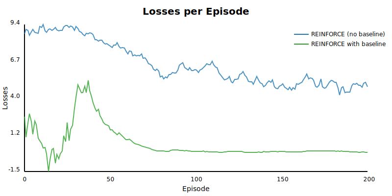
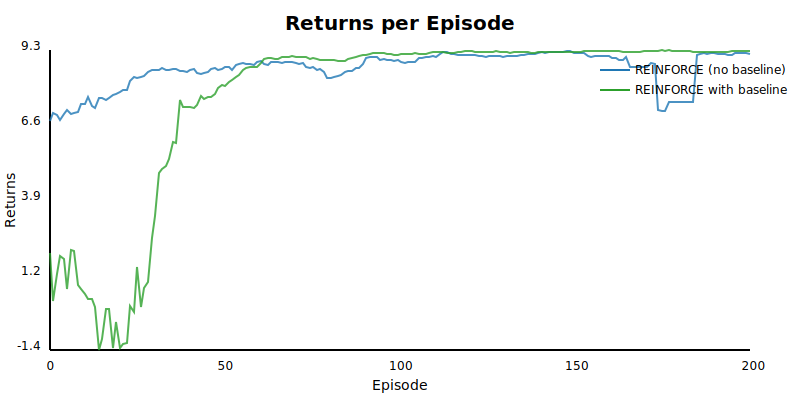
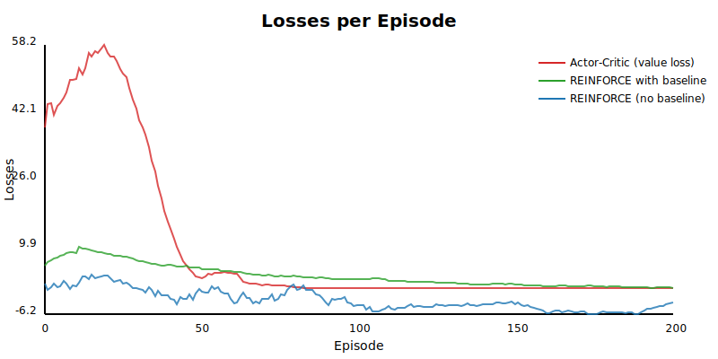
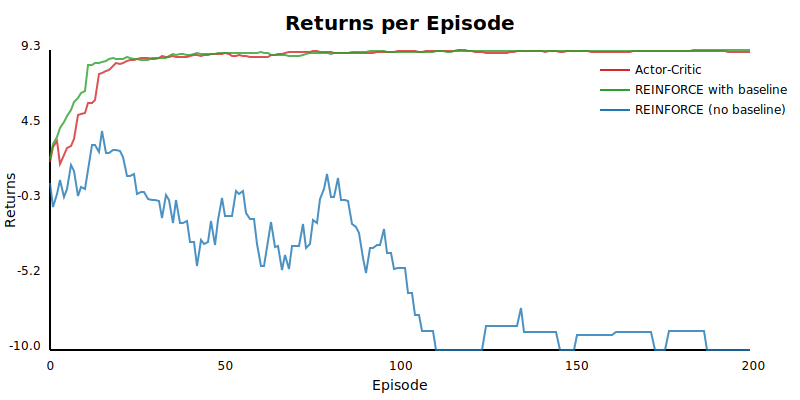
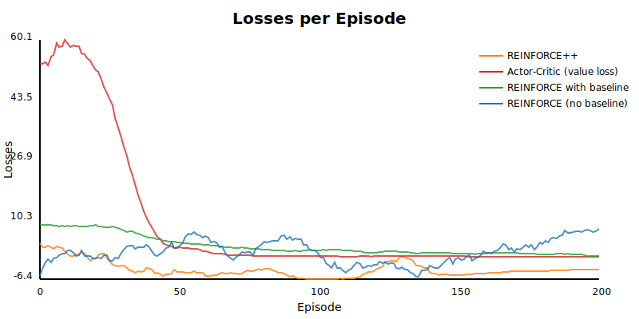
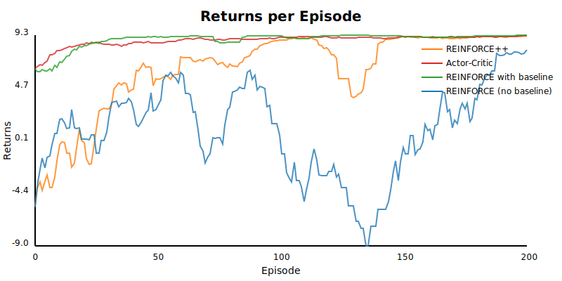

# Reinforcement Learning: An Introduction to REINFORCE

<style>
  #slipshow-content {
    font-size: 1.2em;
  }
</style>

Welcome to reinforcement learning!

1. **Part A:** on-policy algorithms
2. **Part B:** Sokoban, curriculum learning, representation engineering for agents and environments

{.unrevealed #claude-disclaimer}
**Created with, and almost exclusively by, Claude**

{.unrevealed #code-disclaimer}
**Apologies for excessive comments and code duplication**

## What is Reinforcement Learning? {#rl-definition}

{.definition title="Reinforcement Learning"}
Instead of learning from labeled examples, an **agent** learns by **acting** in an **environment** and receiving **rewards**.

{pause reveal=claude-disclaimer}

{pause reveal=code-disclaimer}

{pause center #rl-framework}
### The RL Framework

> **Agent**: The learner (your neural network with weights θ)
> 
> **Environment**: The world the agent interacts with  
> 
> **Actions**: What the agent can do
> 
> **States**: What the agent observes about the environment
> 
> **Rewards**: Feedback signal (positive or negative)

{pause up=rl-framework}

{.example title="Concrete Example: Sokoban Puzzle"}
- **Environment**: Grid world with boxes, walls, targets
- **Agent**: Neural network controlling a character
- **States**: Current positions of character, boxes, walls (as pixel grid or feature vector)
- **Actions**: Move up, down, left, right (4 discrete actions)
- **Rewards**: +10 for solving puzzle, -1 per step, -5 for invalid moves

{pause down=setup-first-env}

### Workshop Setup: Your First Environment

{#setup-first-env}
Let's start by creating a simple grid world environment using Fehu:

{pause down="~duration:15"}
{slip include src=../example/sokoban/workshop/slide1.ml}

{pause center .block title="Setup"}
1. `gh repo clone lukstafi/raven-sokoban raven-workshop-stage1 -- --branch feat/sokoban-rl-environment; cd raven-workshop-stage1`
2. `dune pkg lock` (if needed)
3. `dune exec dev/fehu/example/sokoban/workshop/run1.exe`

{pause center}

Think of it like learning to play a game:
- You (the neural network) don't know the rules initially
- You try actions and see what happens to the environment
- Good moves get rewarded, bad moves get punished
- You gradually learn a strategy by updating your weights

***

{pause up}
## Key Differences from Supervised Learning {#differences}

{#differences-to-supervised}
| **Aspect** | **Supervised Learning** | **Reinforcement Learning** |
|------------|-------------------------|---------------------------|
| **Data** | Fixed dataset with input-output pairs | Generated through interaction with environment |
| **Objective** | Minimize loss function (e.g., MSE, cross-entropy) | Maximize expected cumulative reward |
| **Learning** | Single training phase on static data | Continuous learning from experience |
| **Feedback** | Direct labels for each input | Delayed, sparse rewards for sequences of actions |
| **Data Generation** | Pre-collected and labeled | **You generate your own dataset** by acting |

{pause up}
### What "Dynamic Interaction" Means for Your Neural Network

In supervised learning, your network processes:  
`input → prediction`

In RL, your network (the agent) does:  
`state → action → new_state + reward`
- **Each forward pass** produces an action that changes the world
- **The world responds** with a new state and reward
- **You experience the consequences** of your network's outputs
- **Your training data** comes from your own actions

{pause}

**No pre-labeled data** - the agent must discover what actions are good through trial and error.

***

{pause center #policy-intro}
## The Policy: Your Agent's Strategy

{.definition title="Policy π(a|s,θ)"}
The probability of taking action **a** in state **s**, parameterized by neural network weights **θ**.

{pause down .definition title="State vs Observation (Precise Definition)"}
- **Environment state**: Complete description of environment (all Sokoban box/wall positions)
- **Observation**: What the agent sees (may be partial, e.g., local 5×5 grid view)
- **Information state**: What your neural network system represents about the environment (e.g., current observation + recurrent hidden state from past observations)

{pause down}
Both environment and information states are **Markovian** - they capture all relevant history for decision-making.

{pause down #prob-policies}
> ### Why Probabilistic Policies?
> **Key insight**: We need to **synthesize our own training dataset** through exploration!

{pause up=prob-policies}
**Benefits**:
1. **Smooth changes** = **stable learning**
2. **Natural exploration** - probability spreads across actions
3. **Dataset synthesis** - stochastic policy generates diverse experiences

{pause .example title="Policy Examples in Sokoban"}
- **Neural network output**: 4 action preferences [up, down, left, right]
- **Softmax conversion**: [0.1, 0.6, 0.2, 0.1] probabilities  
- **Action sampling**: Choose "down" with 60% probability
- **Learned parameters**: θ represents all network weights and biases

### Workshop Part 2: Create Your First Policy Network

{pause down}
{.note title="Numerical Stability Tip"}
> When computing log probabilities from a neural network:
> - **Avoid**: `log(softmax(logits))` - can underflow for small probabilities
> - **Prefer**: Direct log-softmax computation:  
>   `logits - log(sum(exp(logits)))`
> - **Better**: Use the numerically stable version with max subtraction:
>   ```
>   log_softmax x = x - max x - log(sum(exp(x - max x)))
>   ```
> This prevents overflow in exp() and maintains precision across the full range.

{pause down="run-slide-2 ~duration:15"}
{slip include src=../example/sokoban/workshop/slide2.ml}

{#run-slide-2}
`dune exec dev/fehu/example/sokoban/workshop/run2.exe`

***

{pause up #episodes}
## Episodes and Returns

{.definition title="Episode"}
A complete sequence of interactions from start to terminal state.

{.definition title="Return $G_t$"}
The total reward from time step t until the end of the episode:
$$G_t = R_{t+1} + R_{t+2} + ... + R_T$$

{pause}
> **Note on Discounting**: For simplicity, we present **episodic** (undiscounted) returns here, following Sutton's preference for clarity. However, the workshop code uses **discounted** returns with γ=0.99:
> $$G_t = R_{t+1} + \gamma R_{t+2} + \gamma^2 R_{t+3} + ...$$
> Both approaches work well; discounting helps with numerical stability and infinite horizons.

{pause down .definition title="Value of a State $V^\pi(s)$"}
The expected return when starting from state s and following policy π:
$$V^\pi(s) = \mathbb{E}_\pi[G_t | S_t = s]$$

{pause down}
> ### Supervised Learning Analogy
> 
> | **Supervised Learning** | **Reinforcement Learning** |
> |--------------------------|----------------------------|
> | **Input**: x | **State**: s |
> | **Target**: y | **Return**: G_t (discovered through interaction) |
> | **Loss**: (prediction - target)² . . | **"Loss"**: -(expected return) |
> | **Gradient**: ∇ loss | **Policy Gradient**: ∇ (expected return) |

{pause center}
### The Goal

**Maximize expected return** by updating network weights θ to improve the policy.

{pause}

But how do we compute gradients when the "target" (return) depends on our own actions?

{pause}

### Workshop Part 3: Collect an Episode

{pause down="run-slide-3 ~duration:15"}
{slip include src=../example/sokoban/workshop/slide3.ml}

{#run-slide-3}
`dune exec dev/fehu/example/sokoban/workshop/run3.exe`

***

{pause center #reinforce-intro}
## Enter REINFORCE

{.definition title="The REINFORCE Algorithm"}
A **policy gradient** method that directly optimizes the policy parameters (network weights θ) to maximize expected return.

{pause up=reinforce-intro}
### Core Insight

We want to:
1. **Increase** the probability of actions that led to high returns
2. **Decrease** the probability of actions that led to low returns

{pause}

{.example title="Sokoban Example"}
> If pushing a box toward a target (action "up") led to solving the puzzle (G_t = +9):
> - **Increase** probability of choosing "up" in that state
> - **Strengthen** neural network weights that favor "up"

***

{pause up #gradient-theorem}
## The Policy Gradient Theorem

The gradient of expected return with respect to policy parameters θ:

$$\nabla_\theta J(\theta) \propto \sum_s \mu(s) \sum_a q_\pi(s,a) \nabla_\theta \pi(a|s,\theta)$$

This looks complicated, but REINFORCE gives us a simple way to estimate it!

{pause .theorem title="REINFORCE Gradient Estimate"}
$$\nabla_\theta J(\theta) = \mathbb{E}_\pi\left[G_t \nabla_\theta \ln \pi(A_t|S_t,\theta)\right]$$

***

{pause center #monte-carlo-necessity}
## Why Monte Carlo? The Partial Feedback Problem

### The Fundamental Challenge

To compute the policy gradient analytically, we'd need:

$$\nabla J(\theta) = \sum_{s,a} \mu(s) \cdot \pi(a|s) \cdot Q^\pi(s,a) \cdot \nabla \log \pi(a|s)$$

But we **don't know** $Q^\pi(s,a)$ - the expected return for taking action $a$ in state $s$!

### Why This Is Different from Supervised Learning

<style>
   table { border-collapse: collapse; width: 100%; margin: 1em 0; } td, th { border: 1px solid #ddd; padding: 12px; text-align: left; } th { background-color: #f2f2f2; font-weight: bold; } tr:nth-child(even) { background-color: #f9f9f9; }
</style>

{pause down .comparison title="Supervised vs Reinforcement Learning"}
| **Supervised Learning** | **Reinforcement Learning** |
|------------------------|---------------------------|
| Know target y for ALL classes | Only know G_t for action taken |
| Full feedback: P(y\|x) for all y | Partial feedback: One action's outcome |
| Can compute exact gradient | Must approximate with samples |
| Loss = -Σ y_true · log(y_pred) | Loss = -G_t · log π(a_taken \| s) |

{pause down}
### The Monte Carlo Solution: Sample to Approximate Expectation

***

{pause center #algorithm-reinforce}
## REINFORCE Algorithm Steps

{.block title="REINFORCE Algorithm"}
1. **Initialize** policy parameters θ (neural network weights) randomly
2. **For each episode**:
   - Generate episode following π(·|·,θ)
   - For each step t in episode:
     - Calculate return: $G_t = \sum_{k=t+1}^T R_k$
     - Update: $\theta \leftarrow \theta + \alpha G_t \nabla_\theta \ln \pi(A_t|S_t,\theta)$

{pause up=algorithm-reinforce}

### Workshop Part 4: Implement Basic REINFORCE

{pause down="~duration:15"}
{slip include src=../example/sokoban/workshop/slide4.ml}

{pause up .block title="Playtime and Exercise 1"}
> 1. `dune exec dev/fehu/example/sokoban/workshop/run1.exe` up to `run4.exe`
> 2. `dune exec dev/fehu/example/sokoban/workshop/plots.exe -- -a reinforce -env gridworld` etc.
> 3. Solve Exercise 1 part A
> 4. Read Exercise 1 part B, don't start solving yet
> {slip include src=../example/sokoban/workshop/exercise1.md}

{pause center #high-variance-problem}
### Key Properties: High Variance Problem

REINFORCE is an **unbiased** but **high variance** estimator.

{#impact-high-variance}
**Practical Impact of High Variance**:
- Learning is **slow** and **unstable**
- Need many episodes to see improvement
- Updates can be huge (good episode) or tiny (bad episode)
- **Episode-by-episode learning** amplifies noise

***

{pause up=impact-high-variance}
### In Practice

You'll typically:
1. Use **automatic differentiation** to compute ∇ ln π
2. **Collect episodes** in batches for stability
3. Apply **baseline subtraction** to reduce variance

***

{pause up #baselines}
## Reducing Variance with Baselines

REINFORCE can be **very noisy**. We can subtract a baseline b(s) from returns:

$$\nabla_\theta J(\theta) = \mathbb{E}_\pi\left[(G_t - b(S_t)) \nabla_\theta \ln \pi(A_t|S_t,\theta)\right]$$

{pause}

From Sutton & Barto:

> "The baseline can be any function, even a random variable, as long as it does not vary with a; the equation remains valid because the subtracted quantity is zero"

{pause}

> "In some states all actions have high values and we need a high baseline to differentiate the higher valued actions from the less highly valued ones"

{pause down .example title="Baseline Options"}
> 
> **Simple Average Baseline**:
> - $b = \frac{1}{N} \sum_{i=1}^N G_{t,i}$ (average return over past N episodes)
> - **Not learned** - just computed from episode history
> - Easy to implement, somewhat effective
> 
> **Learned State-Dependent Baseline**:
> - $b(s,w)$ - separate neural network with weights w
> - **Learned** to predict V(s) using gradient descent
> - More complex but much more effective

{pause down}
### Workshop Part 5: Add a Simple Baseline

{pause down="~duration:15"}
{slip include src=../example/sokoban/workshop/slide5.ml}

{pause down focus .block}
> 
> 


***

{pause unfocus center #reinforce-baseline}
## REINFORCE with Learned Baseline

{.block title="REINFORCE with Learned Baseline Algorithm"}
1. **Initialize** policy parameters θ and **baseline parameters w**
2. **For each episode**:
   - Generate episode following π(·|·,θ)
   - For each step t:
     - $G_t = \sum_{k=t+1}^T R_k$
     - $\delta = G_t - b(S_t,w)$ ← **prediction error**
     - $\theta \leftarrow \theta + \alpha_\theta \delta \nabla_\theta \ln \pi(A_t|S_t,\theta)$ ← **policy update**
     - $w \leftarrow w + \alpha_w \delta \nabla_w b(S_t,w)$ ← **baseline update**

{pause up=reinforce-baseline}
The baseline **neural network** is learned to predict expected returns, reducing variance without introducing bias.

**Two networks training simultaneously**:
- **Policy network**: θ parameters, outputs action probabilities
- **Baseline network**: w parameters, outputs state value estimates

{pause}

### Workshop Part 6: Learned Baseline (Actor-Critic)

{pause down="~duration:15"}
{slip include src=../example/sokoban/workshop/slide6.ml}

{pause down focus .block}
> 
> 


{pause up .block title="Solve Exercise 1 Part B"}
> {slip include src=../example/sokoban/workshop/exercise1.md}

{pause center .block title="Advance to solved"}
1. `gh repo clone lukstafi/raven-sokoban raven-workshop-stage2 -- --branch feat/sokoban-exercise1-solution`
2. `cd ../raven-workshop-stage2`
3. Play with `plots.exe`

***

{pause unfocus center}
### Actor-Critic Methods

REINFORCE with baseline is a simple actor-critic method:
- **Actor**: The policy π(a|s,θ)
- **Critic**: The baseline b(s,w)

For spatial tasks like Sokoban, both networks benefit from convolutional architectures (see Exercise 4) that preserve grid structure.

***

{pause down=midpoint-takeaways}
## Midpoint Summary

{#midpoint-takeaways .block title="Key Takeaways"}
> 
> ✓ **RL learns from interaction**, not labeled data
> 
> ✓ **REINFORCE optimizes policies directly** using policy gradients  
> 
> ✓ **Returns weight gradient updates** - high returns → strengthen action probabilities
> 
> ✓ **Baselines reduce variance** without introducing bias
> 
> ✓ **Actor-critic architectures** combine policy and value learning

***

{pause center #policy-ratios}
## Policy Ratios and Importance Sampling

REINFORCE has a fundamental limitation: it can only use data from the **current** policy.

{pause up=policy-ratios}
### The Problem with Policy Updates

After each gradient step, our policy π(a|s,θ) changes. But what about all that expensive experience we just collected?

{.example title="Sokoban Training Reality"}
- Collect 1000 episodes with current policy → expensive!
- Update policy weights θ → policy changes
- Old episodes are now **off-policy** → can't use them directly

{pause center #importance-sampling}
> ### Solution: Importance Sampling
> 
> **Key insight**: We can reuse off-policy data by weighting it appropriately.

{pause}

{.definition title="Policy Ratio"}
$$\text{ratio}_{t} = \frac{\pi_{\theta_{new}}(a_t|s_t)}{\pi_{\theta_{old}}(a_t|s_t)}$$

This tells us how much more (or less) likely the action was under the new policy vs. old policy.

{pause down}
**Importance-weighted REINFORCE update**:
$$\theta \leftarrow \theta + \alpha \cdot \text{ratio}_t \cdot G_t \cdot \nabla_\theta \ln \pi(a_t|s_t,\theta)$$

{pause up=importance-sampling}
{.example title="Policy Ratio Interpretation"}
- `ratio = 2.0`: New policy twice as likely to take this action
- `ratio = 0.5`: New policy half as likely to take this action  
- `ratio = 1.0`: No change in action probability

***

{pause center #clipping}
## The Problem: Unbounded Policy Updates

Importance sampling allows off-policy learning, but creates a new problem: **unbounded ratios**.

{pause up=clipping}

{.example title="When Ratios Explode"}
If old policy had π_old(action) = 0.01 and new policy has π_new(action) = 0.9:

**ratio = 0.9 / 0.01 = 90**

With a high return G_t = +10: **update = 90 × 10 = 900**

This massive update can destabilize training!

{pause .remark title="See full slides for Clipping and KL-Penalty"}
Skipping here parts 7 to 9.

{pause down focus .block}
> 
> 
>
> REINFORCE with non-learned baseline, clipping and KL-penalty appears very unstable, worth investigating!

***

{pause center #grpo-algorithm}
## Group Relative Policy Optimization (GRPO)

Now we can understand GRPO: **REINFORCE + GRPO Innovation + Clipping + KL Penalty**

{pause up=grpo-algorithm}

{.definition title="GRPO: The Complete Picture"}
> GRPO combines all the techniques we've learned:
> 1. **Group baselines** - Compare responses to the **same query** (GRPO's key innovation)
> 2. **Policy ratios** for off-policy learning
> 3. **Clipping** for stable updates  
> 4. **KL penalties** for additional safety

{pause down .definition title="Group Baselines: The Key Innovation"}
> Instead of comparing to historical episodes from different queries:
> - Generate **G responses** to the **same query**
> - Compute advantages relative to **this group**: $A_i = (r_i - \text{mean}_\text{group}) / (\text{std}_\text{group} + ε)$
> - Much better signal: "How good was this response compared to other attempts at the same problem?"

{pause down .remark title="Skipping further discussion of GRPO"}
See the full slides.

***

{pause center}
## PPO's Key Innovation: Multiple Updates Per Batch

While GRPO achieves sample efficiency through multiple trajectories from the same state, PPO takes a different approach: **reusing collected data through multiple gradient updates**.

{pause down=ppo-multibatch-pseudocode}
### PPO's Solution: Batch Collection and Reuse

{#ppo-multibatch-pseudocode}
```python
# Pseudocode for PPO's core innovation
def train_ppo(env, n_iterations, batch_size, n_epochs):
  for iteration in range(n_iterations):
    # Step 1: Collect BATCH of trajectories
    batch = collect_episodes(env, policy, batch_size)
    old_policy = copy(policy)

    # Step 2: Multiple optimization epochs on SAME data
    for epoch in range(n_epochs):
      # Typically 3-10 epochs
      for trajectory in batch:
        # Compute ratio using FIXED old_policy
        ratio = pi(a|s) / old_pi(a|s)
        # Update with clipped objective
        loss = clip(ratio, 1-ε, 1+ε) * advantage
        update_policy(loss)
```

{pause center}
### Why This Works

1. **Fixed Reference Point**: `old_policy` stays constant during all epochs, providing a stable trust region
2. **Clipping Becomes Essential**: As the policy diverges from `old_policy` over multiple updates, clipping prevents overfitting to the batch
3. **Sample Efficiency**: Extract 3-10x more learning from each environment interaction

{.remark title="Skipping a long discussion of PPO vs. Replay Buffers"}
See full slides.

{pause down .block title="Optional Exercise 3: Implementing Full PPO"}
> Upgrade REINFORCE++ to full PPO by adding:
> 1. Batch trajectory collection
> 2. Multiple optimization epochs per batch
> 3. Proper importance sampling with fixed old_policy
>
> See `exercise3.md` for detailed instructions and full slides for better context.

***

{pause up}
## Part B: Curriculum Learning with Sokoban

After mastering policy optimization algorithms, let's explore how to train agents on complex tasks using **curriculum learning** - the art of teaching through progressively harder challenges.

### The Challenge: Learning Complex Tasks

Imagine teaching an agent to solve this Sokoban puzzle:

```
#########
#   @   #  @ = player
# o o o #  o = box
#       #  x = target
# x x x #
#       #
#########
```

{pause unreveal=exercise-cnn unstatic=exercise-cnn unstatic=exercise-4-content unreveal=exercise-4-content}
> Starting with such complexity leads to:
> - **Sparse rewards**: Agent rarely solves the puzzle randomly
> - **No learning signal**: Without successes, gradients are uninformative
> - **Wasted computation**: Millions of failed attempts


{pause up}
### Domain-Specific Engineering: From Clever Algorithms to Clever Environments

{pause}
#### The Old Way: Algorithm Engineering

Historically, each domain got its own specialized algorithm:
- **Chess**: Alpha-beta pruning with hand-crafted evaluation functions
- **Go**: Monte Carlo Tree Search with domain-specific patterns
- **Robotics**: Trajectory optimization with physics models
- **Games**: Behavior trees and finite state machines

Each required deep domain expertise and years of refinement.

{pause down}
> #### The New Way: Environment Engineering
> 
> Modern RL focuses on general algorithms (PPO, SAC, DQN) trained on carefully designed environments:
> - **OpenAI Five**: Dota 2 with curriculum of increasing difficulty
> - **AlphaStar**: StarCraft with league play and exploiter agents
> - **Rubik's Cube**: Domain randomization for sim-to-real transfer
> - **LLM Fine-tuning**: Synthetic data generation and quality filtering
> 
> The algorithms stay the same; the environments become sophisticated.

{pause up}
### Critical: Environment Quality Control

Not all environments are created equal. A seemingly simple Sokoban puzzle might be:
- **Unsolvable**: No valid sequence reaches the goal
- **Trivially solvable**: Random actions quickly succeed
- **Degenerate**: Multiple boxes in corners (deadlock)
- **Ambiguous**: Multiple contradictory solutions

{pause up}
### Case Study: Sokoban Curriculum Quality

For our Sokoban curriculum, we should ensure:

1. **Stage 1 (Corridor)**:
   - Always solvable in ≤5 moves
   - No deadlock states possible
   - Single box, straight line to target

2. **Stage 2 (Simple Room)**:
   - Solvable in 5-15 moves
   - No corner deadlocks
   - Requires basic path planning

3. **Stage 3 (Multi-box)**:
   - All boxes independently moveable
   - No interdependent deadlocks
   - Multiple solution paths

{pause up}
### Implementation: Automatic Curriculum Progression

{.code title="Slide 10: Curriculum Management"}
```ocaml
type curriculum_state = {
  current_stage: int;
  recent_wins: bool Queue.t;  (* Track last N episodes *)
  episodes_in_stage: int;
}

let should_advance state window_size =
  let wins = Queue.fold (+) 0 state.recent_wins in
  let win_rate = wins / window_size in
  win_rate >= stage.success_threshold

let update_curriculum state won =
  Queue.add won state.recent_wins;
  if should_advance state then
    advance_to_next_stage state
  else
    state
```

{pause center .block title="Curriculum: Empirical Exercise"}
Compare the badly-designed environment `curriculum` (code: `slide10.ml`) and the better environment `verified-curriculum` (code: `verified.ml`) using `plots.exe`

***

{pause up}
## Scaling to bigger boards

{.block title="Exercise 4: CNN-based Policy and Value Networks" #exercise-cnn}
> Replace fully-connected networks with convolutional neural networks:
> 1. Design CNN architectures using conv2d layers
> 2. Preserve spatial structure of the grid
> 3. Compare learning efficiency with FC networks
>
> See `exercise4.md` for implementation guide.

{pause}
{slip include src=../example/sokoban/workshop/exercise4.md}

{pause center .block title="Advance to solved"}
1. `gh repo clone lukstafi/raven-sokoban raven-workshop-stage3 -- --branch feat/sokoban-exercise4-solution`
2. `cd ../raven-workshop-stage3`
3. Run `test_cnn_comparison.exe`
3. Play with `plots.exe`

***

{pause down=fin}

## References

{#refs-sutton-barto}
Sutton, R. S., & Barto, A. G. (2018). *Reinforcement learning: An introduction* (2nd ed.). MIT Press.

Skiredj, A. (2025). *The Illustrated GRPO: A Detailed and Pedagogical Explanation of GRPO Algorithm*. OCP Solutions & Mohammed VI Polytechnic University, Morocco.

{#fin}